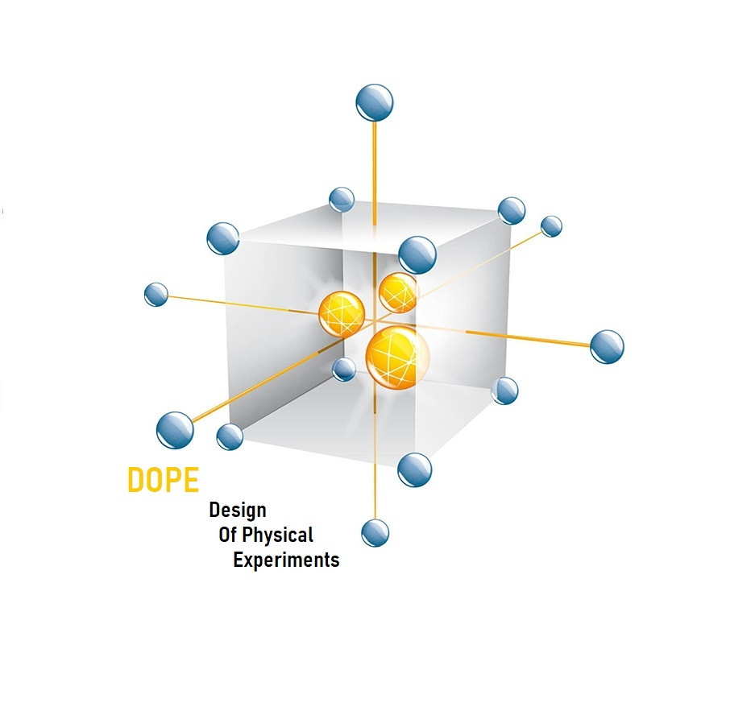

# Plan d'expériences physiques pour la calibration de codes de calcul coûteux (à sortie scalaire)

Ce dépôt contient des critères de sélection de plans d'expériences physiques pour la calibration d'un code de calculs coûteux à sortie scalaire. Le cadre statistique utilisé est celui de [Kennedy et O'Hagan (2001)](https://www.asc.ohio-state.edu/statistics/comp_exp/jour.club/kennedy01.pdf). L'objectif est de sélectionner le plan d'expériences physiques par optimisation d'un critère d'optimalité :

$$
X_{\text{opt}} \in \text{argmax} C_{\text{opt}}(X) \quad \text{ ou } \quad X_{\text{opt}} \in \text{argmin} C_{\text{opt}}(X)
$$

## Description
### Critères d'optimalités de plan d'expériences physiques
Les critères suivants sont disponibles dans ce dépôt :

- **Critères bayésiens** : ces critères, basés sur la densité a posteriori, sont implémentés par la fonction suivante :

    ```r
    CoptBayes(X, model, Dx, Dtheta, sigeps, dprior, rprior, L = 1000, K = 1000, typeCopt = 'KL', type = 'SK', ...)
    ```
    
    - `typeCopt = 'SOV'` : somme des variances a posteriori ;
    - `typeCopt = 'MSE'` : erreur quadratique moyenne a posteriori ;
    - `typeCopt = 'KL'`  : divergence de Kullback-Leibler entre la densité a priori et la densité a posteriori.

- **Critères bayésiens linéaires** : une version des critères bayésiens pour les codes de calcul linéaires et les densités a priori gaussiennes.

    ```r
    CoptBayesLin(X, model, Dx, Dtheta, thetaprior, Sigmaprior, sigeps, L = 1000, typeCopt = 'KL', type = 'SK', ...)
    ```

- **Critères alphabétiques** : inclut le critère ED-optimalité ainsi que le critère ET-optimalité.

    ```r
    CoptMFisher(X, model, sigeps, Dx, Dtheta, dftheta, typeCopt = "Det", L = 1000, type = 'SK')
    ```

    - `typeCopt = 'Det'` : determinant de la matrice d'information de Fisher ;
    - `typeCopt = 'Tr'` : trace de la matrice d'information de Fisher ;
    - `typeCopt = 'DetInv'`  : determinant de l'inverse de la matrice d'information de Fisher;
    - `typeCopt = 'TrInv'` : trace de l'inverse de la matrice d'information de Fisher.

- **Critère glouton** : ce critère exploite la variation du code de calcul et la répartition du plan d'expériences dans l'espace expérimental.

    ```r
    CVMm(X, model, Dx, Dtheta, L = 1000, type = "SK", alpha = 0.5)
    ```

*NB : Ces critères sont calculés à l'aide d'un émulateur de processus gaussien (*model*) à fournir en entrée.*

### Optimisation

Pour optimiser l'un de ces critères, un algorithme de recuit simulé est disponible :

```r
SAOptim(Xinit, f, Dx, maxiter=1e4, c = 0.99, Tinit = 0.1, Paccept = "metropolis", schema = "geo")
```
 Un algorithme glouton est egalement disponible.

 ```r
 ForwardOptim(f, Dx, nD, N=1000, tomax=TRUE, echo=TRUE)
 ```
Vous pouvez aussi installer et utiliser l'un des algorithmes d'optimisation proposés dans le package DOEoptimizer, disponible sur ce GitHub.

## Installation 

Clonez ce dépôt pour télécharger les fichiers en local :

```bash
git clone https://github.com/TheseAdama/DOPEcal.git
```
Vous pouvez également télécharger directement le fichier ZIP depuis GitHub.

# Package R : 
Exécutez le code suivant dans R pour installer les packages nécessaires : 

 ```r
install.packages(c("Dicekriging", " ", " "))
 ```

# Reference
**Adama Barry, François Bachoc, Sarah Bouquet, Miguel Munoz Zuniga, Clémentine Prieur. _Optimal Design of Physical and Numerical Experiments for Computer Code Calibration_. 2024. [hal-04615127v2](https://theses.hal.science/UNIV-UT3/hal-04615127v2)**

